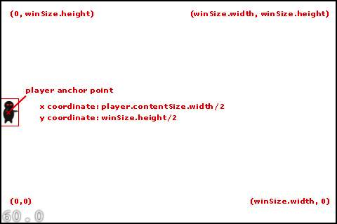
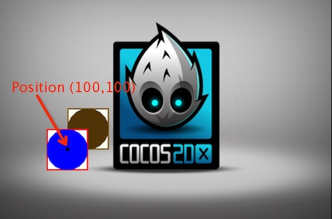
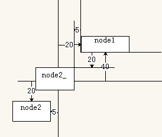

# Chapter 6: Building and Transitioning Scenes

## What is a Scene?
A `Scene` is a container that holds `Sprites`, `Layers` and other rendered content. A `Scene` is responsible for running game logic and rendering the content on a per-frame basis. 

## Creating a Scene
It is very easy to create a `Scene`
```cpp
// create a simple scene
cocos2d::Scene* myScene = cocos2d::Scene::create();

// create a simple scene with physics
cocos2d::Scene* scene = cocos2d::Scene::createWithPhysics();
```

### Creating a Node Tree
A `Node` tree controls the draw order of GUI elements. This might also be referred to as `scene graph priority`. The important thing to remember is that this defines the drawing order of the GUI elements, starting first to last.

A simple `Node` tree laid out in code:
```cpp
// create a simple scene
auto myScene = cocos2d::Scene::create();

// create a simple layer
auto myLayer = cocos2d::Layer::create();

// a few Sprites
auto sprite1 = cocos2d::Sprite::create("sprite.png");
auto sprite2 = cocos2d::Sprite::create("sprite.png");
auto sprite3 = cocos2d::Sprite::create("sprite.png");

// a few more Sprites
auto spriteA = cocos2d::Sprite::create("sprite2.png");
auto spriteB = cocos2d::Sprite::create("sprite2.png");
auto spriteC = cocos2d::Sprite::create("sprite2.png");

sprite1->addChild(spriteA); // spriteA is now a child of sprite1
sprite2->addChild(spriteB); // spriteB is now a child of sprite2
sprite3->addChild(spriteC); // spriteC is not a child of sprite3

myLayer->addChild(sprite1); // sprite1 is now a child of myLayer
myLayer->addChild(sprite2); // sprite2 is now a child of myLayer
myLayer->addChild(sprite3); // sprite3 is now a child of myLayer

myScene->addChild(myLayer); // myLayer is now a child of myScene
``` 
### Node properties to its descendants
An important thing to remember is that properties applied to `Node` are cascaded down to its children.     

## Coordinate Systems
We all know about `Coordinate systemS` from various school math classes. If you have forgotten, these images will remind you quickly:


There’re 3 types of `Coordinate Systems` that you will meet in mobile games development.

### UI Coordinate Systems

In common UI Coordinates on iOS/Android/Windows SDK:

*    The origin (x=0, y=0) is at the top-left corner.
*    X axis starts at the left side of the screen and increase to the right;
*    Y coordinates start at the top of the screen and increase downward,

looks like this


### Direct3D Coordinate System

DirectX uses Left-handed Cartesian Coordinate.

### OpenGL and Cocos2d Coordinate System

Cocos2d-x/-JS uses the same `Coordinate system` as OpenGL, which is so called “Right-handed Cartesian Coordinate System”.


We only use x-axis & y-axis in 2D world. So in your cocos2d games:

* The origin (x=0, y=0) is in the bottom-left corner of screen, which means the screen is in the first quartile of right-handed cartesian coordinate system,
* X axis starts at the left side of the screen and increase to the right;
* Y axis starts at the bottom of the screen and increase upwards.

And here’s a picture that helps illustrate Cocos2d-x Coordinates a bit better:


Note that it’s different from common UI coordinate systems and DirectX coordinate systems.

###Positions in Coordinate Systems

Every class derived from *Node* (Ultimate cocos2d-x class) will have a anchorPoint property.
When determining where to draw the object (sprite, layer, whatever), cocos2d-x will combine both properties position and anchorPoint. Also, when rotating an object, cocos2d-x will rotate it around its anchorPoint.

We create a sprite as a gray parent and another sprite as blue child.Set parent’s position to Vec2(100,100),child’s anchor point in the center of circle .

```cpp
Sprite* parent = Sprite::create("parent.png");
parent->setAnchorPoint(Vec2(0, 0));// Anchor Point
parent->setPosition(Vec2(100, 100));
addChild(parent);

//create child 
Sprite* child = Sprite::create("child.png");
child->setAnchorPoint(Vec2(0.5, 0.5));
child->setPosition(Vec2(0, 0));
parent->addChild(child);//add child sprite into parent sprite.  
```

Although we set child’s position of Vec2(0,0),parent’s position is Vec2(100,100).Therefore,child’s position is :


###Coordinate Systems with Anchor Point

The anchor point is used for both positioning and rotating an object. The anchor point coordinates are relative coordinates which usually correspond to a point within an object. For example, the anchor point Vec2(0.5, 0.5) corresponds to the center of the object. When setting the position of the object, the object is positioned such that the anchor point will be at the coordinates specified in the *setPosition* call. Similarly, when rotating the object, it is rotated about the anchor point.
For example, this sprite has an anchorPoint of Vec2(0,0) and a position of Vec2(0,0):


As a result, the sprite is positioned such that its anchor point is placed at the bottom left corner of its parent layer.

```cpp
// create sprite
Sprite* sprite = Sprite::create("bottomleft.png");
sprite->setAnchorPoint(Vec2(0, 0));// Anchor Point
sprite->setPosition(Vec2(0,0));
addChild(sprite);
```


In the following example, the relative nature of the anchor co-ordinates is demonstrated. The anchor point is assigned to be Vec2(0.5, 0.5), which corresponds to the center of the sprite.


```cpp
// create sprite
Sprite* sprite = Sprite::create("center.png");
sprite->setAnchorPoint(Vec2(0.5, 0.5));// Anchor Point
sprite->setPosition(Vec2(0,0));
addChild(sprite);
```


As you can see, the center of the sprite is positioned at Vec2(0.5, 0.5). It can also be seen that the anchor point is not a pixel value. The X and Y values of the anchor point are relative to the size of the node.

### Converting between coordinate systems

#### convertToNodeSpace

`convertToNodeSpace` will be used in, for example, tile-based games, where you have a big map. convertToNodeSpace will convert your openGL touch co-ordinates to the co-ordinates of the .tmx map or anything similar.

Example:

The following picture shows that we have node1 with anchor point (0,0) and node2 with anchor point (1,1).

We invoke 

```cpp
Vec2 point = node1->convertToNodeSpace(node2->getPosition()); 
```

 convert node2’s SCREEN coords to node1’s local.As the result,node2 with the position of (-25，-60).


#### convertToWorldSpace

`convertToWorldSpace` converts on-node coords to SCREEN coordinates. `convertToWorldSpace` will always return SCREEN position of our sprite, might be very useful if you want to capture taps on your sprite but need to move/scale your layer.
Generally, the parent node call this method with the child node position, return the world’s postion of child’s as a result. It seems make no sense calling this method if the caller isn’t the parent.

Example:

```cpp
Point point = node1->convertToWorldSpace(node2->getPosition()); 
```

The above code will convert the node2‘s coordinates to the coordinates on the screen.
For example if the anchor position of node1 is which will be the bottom left corner of the node1, but not necessarily on the screen. This will convert the position of the node2 which is to the screen coordinate of the point relative to node1 ). The result shows in the following picture:



#### convertToWorldSpaceAR

`convertToWorldSpaceAR` will return the position relative to anchor point: so if our scene - root layer has anchor point of Vec2(0.5f, 0.5f) - default, `convertToWorldSpaceAR` should return position relative to screen center.

`convertToNodeSpaceAR` - the same logic as for `convertToWorldSpaceAR`

### Sample code：

```cpp

Sprite *sprite1 = Sprite::create("CloseNormal.png");

sprite1->setPosition(Vec2(20,40));

sprite1->setAnchorPoint(Vec2(0,0));

this->addChild(sprite1);

Sprite *sprite2 = Sprite::create("CloseNormal.png");

sprite2->setPosition(Vec2(-5,-20));

sprite2->setAnchorPoint(Vec2(1,1));

this->addChild(sprite2);

Vec2 point1 = sprite1->convertToNodeSpace(sprite2->getPosition());

Vec2 point2 = sprite1->convertToWorldSpace(sprite2->getPosition());

Vec2 point3 = sprite1->convertToNodeSpaceAR(sprite2->getPosition());

Vec2 point4 = sprite1->convertToWorldSpaceAR(sprite2->getPosition());

LOG("position = (%f,%f)",point1.x,point1.y);

LOG("position = (%f,%f)",point2.x,point2.y);

LOG("position = (%f,%f)",point3.x,point3.y);

LOG("position = (%f,%f)",point4.x,point4.y);
    
```

Result：

```

    position = (-25.000000,-60.000000)

    position = (15.000000,20.000000)

    position = (-25.000000,-60.000000)

    position = (15.000000,20.000000)
    
```
    
## Transitioning between Scenes
You might need to move between `Scenes` in your game. Perhaps starting a new game, changing levels or even ending your game. Cocos2d-x provides a number of ways to do `Scene Transitions`.

### Ways to transition between Scenes
```cpp
auto myScene = cocos2d::Scene::create();

// runWithScene - use this for the first Scene only
cocos2d::Director::getInstance()->runWithScene(myScene);

// replaceScene - replace a scene outright
cocos2d::Director::getInstance()->replaceScene(myScene);

// pushScene - suspends the execution of the running scene, pushing it on the stack
// of suspended scenes. Only call this if there is a running scene
cocos2d::Director::getInstance()->pushScene(myScene);

// popScene - This scene will replace the running one. The running scene will be
// deleted. Only call this if there is a running scene
cocos2d::Director::getInstance()->popScene(myScene);
```

### Transition Scenes with effects
You can add visual effects to your `Scene` transitions
```cpp
auto myScene = cocos2d::Scene::create();

// Transition Fade
cocos2d::Director::getInstance()->replaceScene(cocos2d::TransitionFade::create(0.5, myScene, cocos2d::Color3B(0,255,255)));

// FlipX
cocos2d::Director::getInstance()->replaceScene( cocos2d::TransitionFlipX::create(2, myScene));

// Transition Slide In
cocos2d::Director::getInstance()->replaceScene( cocos2d::TransitionSlideInT::create(1, myScene) );
```
