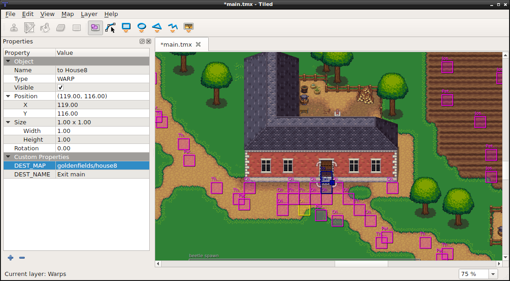
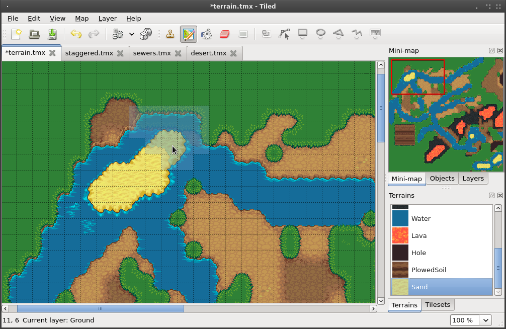

# Chapter 8: Other Node Types

## TMX and Fast TMX
TMX is an XML-based map format originally designed for tile-based maps but
meanwhile also suitable for more generic game levels due to its support
for various object types. Tile-based maps can have many layers, determined by a z-order. Each tile has a unique position and id.

```cpp
// reading in a tiled map.
cocos2d::TMXTiledMap* map = cocos2d::TMXTiledMap::create("TileMap.tmx");
addChild(map, 0, kTagTileMap);

// how to get a specific layer and tile
auto layer = map->layerNamed("Layer 0");
auto tile = layer->tileAt(cocos2d::Vec2(1, 63));

// to obtain a specific tiles id
unsigned int gid = layer->tileGIDAt(cocos2d::Vec2(0, 63));
```
Example Tilemap concepts





## Particle
    
## Parallax
A `Parallax` Node is a special `Node` type that simulates a parallax scroller. You can think of many games that function this way, Super Mario Bros being a classic example.
```cpp

```

## Video (Experimental)
Video playback is supported as an experimental feature. The format of the video is dependent upon the formats the players operating system supports.
```cpp

```


