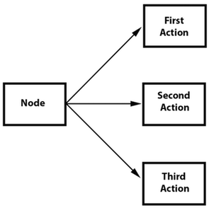

# Chapter 4: Actions
`Action` objects are just like they sound,  make a `Node` perform a change to
its properties. `Action` objects allow the transform of `Node` properties in time.
Any object with a base class of `Node` can have `Action` objects performed on it.
As an example, you can move a `Sprite` from one position to another and do it over
a time span.

Example of `MoveTo` and `MoveBy` action:
```cpp
// Move sprite to position 50,10 in 2 seconds.
auto moveTo = MoveTo::create(2, Vec2(50, 10));
mySprite1->runAction(moveTo);

// Move sprite 20 points to right in 2 seconds
auto moveBy = MoveBy::create(2, Vec2(20,0));
mySprite2->runAction(moveBy);
```

### By and To, what is the difference?
You will notice that each `Action` has a `By` and `To` version. Why? They are
different in what they accomplish. A `By` is relative to the current state of the
`Node`. A `To` action is absolute, meaning it doesn't take into account the
current state of the `Node`. Let's take a look at a specific example:
```cpp
auto mySprite = Sprite::create("mysprite.png");
mySprite->setPosition(Vec2(200, 256));

// MoveBy - lets move the sprite by 500 on the x axis over 2 seconds
// MoveBy is relative - since x = 200 + 200 move = x is now 400 after the move
auto moveBy = MoveBy::create(2, Vec2(500, mySprite->getPositionY()));

// MoveTo - lets move the new sprite to 300 x 256 over 2 seconds
// MoveTo is absolute - The sprite gets moved to 300 x 256 regardless of
// where it is located now.
auto moveTo = MoveTo::create(2, Vec2(300, mySprite->getPositionY()));

auto seq = Sequence::create(moveBy, delay, moveTo, nullptr);

mySprite->runAction(seq);
```


## Basic Actions and how to run them
Basic actions are usually a singular action, thus accomplishing a single objective.
Let's take a look at a few examples:

### Move
Move the `Node` position over a set period of time.
```cpp
auto mySprite = Sprite::create("mysprite.png");

// Move a sprite to a specific location over 2 seconds.
auto moveTo = MoveTo::create(2, Vec2(50, 0));

mySprite->runAction(moveTo);

// Move a sprite 50 pixels to the right, and 0 pixels to the top over 2 seconds.
auto moveBy = MoveBy::create(2, Vec2(50, 0));

mySprite->runAction(moveBy);
```


### Rotate
Rotates a `Node` clockwise over 2 seconds.
```cpp
auto mySprite = Sprite::create("mysprite.png");

// Rotates a Node to the specific angle over 2 seconds
auto rotateTo = RotateTo::create(2.0f, 40.0f);
mySprite->runAction(rotateTo);

// Rotates a Node clockwise by 40 degree over 2 seconds
auto rotateBy = RotateBy::create(2.0f, 40.0f);
mySprite->runAction(rotateBy);
```


### Scale
Scales a `Node` by 10 over 2 seconds.
```cpp
auto mySprite = Sprite::create("mysprite.png");

// Scale uniformly by 3x over 2 seconds
auto scaleBy = ScaleBy::create(2.0f, 3.0f);
mySprite->runAction(scaleBy);

// Scale X by 5 and Y by 3x over 2 seconds
auto scaleBy = ScaleBy::create(2.0f, 3.0f, 3.0f);
mySprite->runAction(scaleBy);

// Scale to uniformly to 3x over 2 seconds
auto scaleTo = ScaleTo::create(2.0f, 3.0f);
mySprite->runAction(scaleTo);

// Scale X to 5 and Y to 3x over 2 seconds
auto scaleTo = ScaleTo::create(2.0f, 3.0f, 3.0f);
mySprite->runAction(scaleTo);
```


### Fade In/Out
Fades In a `Node`.

It modifies the opacity from 0 to 255. The "reverse" of this action is `FadeOut`
```cpp
auto mySprite = Sprite::create("mysprite.png");

// fades in the sprite in 1 seconds
auto fadeIn = FadeIn::create(1.0f);
mySprite->runAction(fadeIn);

// fades out the sprite in 2 seconds
auto fadeOut = FadeOut::create(2.0f);
mySprite->runAction(fadeOut);
```


### Tint
Tints a Node that implements the NodeRGB protocol from current tint to a custom
one.
```cpp
auto mySprite = Sprite::create("mysprite.png");

// Tints a node to the specified RGB values
auto tintTo = TintTo::create(2.0f, 120.0f, 232.0f, 254.0f);
mySprite->runAction(tintTo);

// Tints a node BY the delta of the specified RGB values.
auto tintBy = TintBy::create(2.0f, 120.0f, 232.0f, 254.0f);
mySprite->runAction(tintBy);
```


### Animate
With `Animate` it is possible to do simple flipbook animation with your `Sprite`
objects. This is simply replacing the _display frame_ at set intervals for the
duration of the animation. Let's consider this example:
```cpp
auto mySprite = Sprite::create("mysprite.png");

// now lets animate the sprite we moved

Vector<SpriteFrame*> animFrames;
animFrames.reserve(12);
animFrames.pushBack(SpriteFrame::create("Blue_Front1.png", Rect(0,0,65,81)));
animFrames.pushBack(SpriteFrame::create("Blue_Front2.png", Rect(0,0,65,81)));
animFrames.pushBack(SpriteFrame::create("Blue_Front3.png", Rect(0,0,65,81)));
animFrames.pushBack(SpriteFrame::create("Blue_Left1.png", Rect(0,0,65,81)));
animFrames.pushBack(SpriteFrame::create("Blue_Left2.png", Rect(0,0,65,81)));
animFrames.pushBack(SpriteFrame::create("Blue_Left3.png", Rect(0,0,65,81)));
animFrames.pushBack(SpriteFrame::create("Blue_Back1.png", Rect(0,0,65,81)));
animFrames.pushBack(SpriteFrame::create("Blue_Back2.png", Rect(0,0,65,81)));
animFrames.pushBack(SpriteFrame::create("Blue_Back3.png", Rect(0,0,65,81)));
animFrames.pushBack(SpriteFrame::create("Blue_Right1.png", Rect(0,0,65,81)));
animFrames.pushBack(SpriteFrame::create("Blue_Right2.png", Rect(0,0,65,81)));
animFrames.pushBack(SpriteFrame::create("Blue_Right3.png", Rect(0,0,65,81)));

// create the animation out of the frames
Animation* animation = Animation::createWithSpriteFrames(animFrames, 0.1f);
Animate* animate = Animate::create(animation);

// run it and repeat it forever
mySprite->runAction(RepeatForever::create(animate));
```
It's hard to show an animation in text, so please run the example "Programmer
Guide Sample" code to see this in action!

### Easing
Easing is animating with a specified acceleration to make the animations smooth.
A few things to keep in mind is that regardless of speed, ease actions always
start and finish at the same time. _Ease_ actions are a good way to _fake_ physics
in your game! Perhaps you want a few simulated physics effects but dont want the
overhead and complexity of adding it all for a few very basic actions. Another
good example is to animate menus and buttons.

Here are common easing functions displayed over a graph:


Cocos2d-x supports most of the easing function in the above graph. They are also
simple to implement. Lets look at a specific use case. Lets drop a `Sprite` object
from the top of the screen and make it bounce.
```cpp
// create a sprite
auto mySprite = Sprite::create("mysprite.png");

// create a MoveBy Action to where we want the sprite to drop from.
auto move = MoveBy::create(2, Vec2(200, dirs->getVisibleSize().height - newSprite2->getContentSize().height));
auto move_back = move->reverse();

// create a BounceIn Ease Action
auto move_ease_in = EaseBounceIn::create(move->clone() );

// create a delay that is run in between sequence events
auto delay = DelayTime::create(0.25f);

// create the sequence of actions, in the order we want to run them
auto seq1 = Sequence::create(move_ease_in, delay, move_ease_in_back,
	delay->clone(), nullptr);

// run the sequence and repeat forever.
mySprite->runAction(RepeatForever::create(seq1));
```
Run the example "Programmer Guide Sample" code to see this in action!

## Sequences and how to run them
Sequences are a series of `Action` objects to be executed sequentially. This can
be any number of `Action` objects, _Functions_ and even another `Sequence`.
Functions? Yes! Cocos2d-x has a `CallFunc` object that allows you to create a
_function()_ and pass it in to be run in your `Sequence`. This allows you to add
your own functionality to your `Sequence` objects besides just the stock `Action`
objects that Cocos2d-x provides. This is what a `Sequence` looks like when
executing:


### An example sequence
```cpp
auto mySprite = Sprite::create("mysprite.png");

// create a few actions.
auto jump = JumpBy::create(0.5, Vec2(0, 0), 100, 1);

auto rotate = RotateTo::create(2.0f, 10);

// create a few callbacks
auto callbackJump = CallFunc::create([](){
    log("Jumped!");
});

auto callbackRotate = CallFunc::create([](){
    log("Rotated!");
});

// create a sequence with the actions and callbacks
auto seq = Sequence::create(jump, callbackJump, rotate, callbackRotate, nullptr);

// run it
mySprite->runAction(seq);
```
So what is this `Sequence` action do?

It will executes the following actions sequentially:

`Jump` -> `callbackJump` -> `Rotate` -> `callbackRotate`

Run the example "Programmer Guide Sample" code to see this in action!

### Spawn
Spawn is very similar to `Sequence`, except that all actions will run at the same
time. You can have any number of `Action` objects and even other `Spawn` objects!



`Spawn` produces the same result as running multiple consecutive `runAction()`
statements. However, the benefit of spawn is that you can put it in a `Sequence`
to help achieve specific effects that you cannot otherwise. Combining `Spawn`
and `Sequence` is a very powerful feature

Example, given:
```cpp
// create 2 actions and run a Spawn on a Sprite
auto mySprite = Sprite::create("mysprite.png");

auto moveBy = MoveBy::create(10, Vec2(400,100));
auto fadeTo = FadeTo::create(2.0f, 120.0f);
```

Using a Spawn:
```cpp
// running the above Actions with Spawn.
auto mySpawn = Spawn::createWithTwoActions(moveBy, fadeTo);
mySprite->runAction(mySpawn);
```
and consecutive _runAction()_ statements:

```cpp
// running the above Actions with consecutive runAction() statements.
mySprite->runAction(moveBy);
mySprite->runAction(fadeTo);
```
Both would produce the same result. However, one can use `Spawn` in a `Sequence`.
This flowchart shows the how this might look:


```cpp
// create a Sprite
auto mySprite = Sprite::create("mysprite.png");

// create a few Actions
auto moveBy = MoveBy::create(10, Vec2(400,100));
auto fadeTo = FadeTo::create(2.0f, 120.0f);
auto scaleBy = ScaleBy::create(2.0f, 3.0f);

// create a Spawn to use
auto mySpawn = Spawn::createWithTwoActions(scaleBy, fadeTo);

// tie everything together in a sequence
auto seq = Sequence::create(moveBy, mySpawn, moveBy, nullptr);

// run it
mySprite->runAction(seq);
```
Run the example "Programmer Guide Sample" code to see this in action!

### Reverse
Reverse is exactly like it sounds. If you run a series of actions, you can call
`reverse()` to run it in the opposite order. Backwards. However it is not just
simply running in reverse. It is actually manipulating the properties of the
original `Sequence` or `Spawn` in reverse too.

Using the `Spawn` example above reversing is simple.
 ```cpp
 // reverse a sequence, spawn or action
mySprite->runAction(mySpawn->reverse());
```

Most `Action` and `Sequence` objects are reversible!

It's easy to use, but let's make sure we see what is happening. Given:
```cpp
// create a Sprite
auto mySprite = Sprite::create("mysprite.png");
mySprite->setPosition(50, 56);

// create a few Actions
auto moveBy = MoveBy::create(2.0f, Vec2(500,0));
auto scaleBy = ScaleBy::create(2.0f, 2.0f);
auto delay = DelayTime::create(2.0f);

// create a sequence
auto delaySequence = Sequence::create(delay, delay->clone(), delay->clone(),
delay->clone(), nullptr);

auto sequence = Sequence::create(moveBy, delay, scaleBy, delaySequence, nullptr);

// run it
newSprite2->runAction(sequence);

// reverse it
newSprite2->runAction(sequence->reverse());
```

What is really happening? If we lay out the steps as a list it might be helpful:

   1. `mySprite` is created
   * `mySprite` position is set to (50, 56)
   *  `sequence` starts to run
   *  `sequence` moves `mySprite` by 500, over 2 seconds, `mySprite` new position
   (550, 56)
   *  `sequence` delays for 2 seconds
   *  `sequence` scales `mySprite` by 2x over 2 seconds
   *  `sequence` delays for 6 more seconds (notice we run another sequence to
   accomplish this)
   * we run a `reverse` on the sequence so we re-run each action backwards
   * `sequence` is delayed for 6 seconds
   * `sequence` scales `mySprite` by -2x over 2 seconds
   * `sequence` delays for 2 seconds
   * `sequence` moves `mySprite` by -500, over 2 seconds, `mySprite` new position
   (50, 56)

You can see that a `reverse()` is simply for you to use, but not so simple in
it's internal logic. Cocos2d-x does all the heavy lifting!
