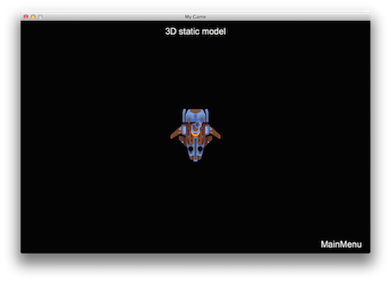
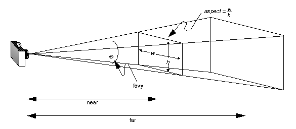
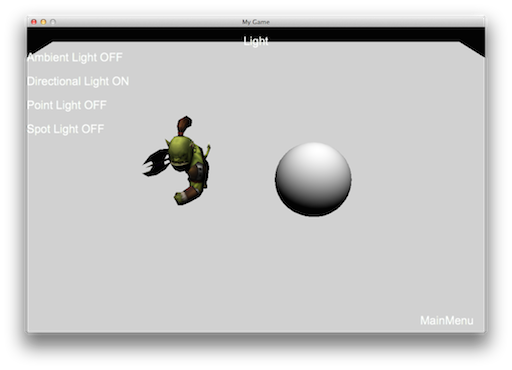
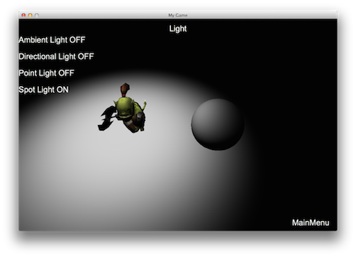
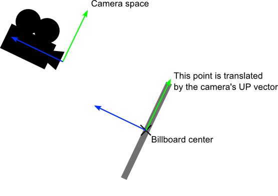
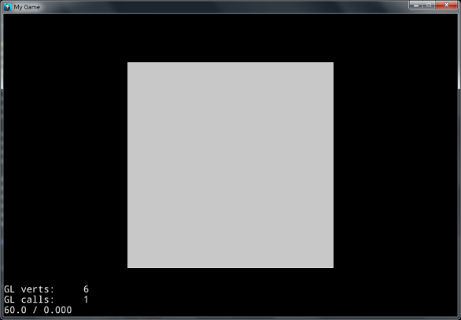

# Chapter 9: 3D
You probably started with Cocos2d-x and know it as a 2D game engine. Starting
with version 3, 3D features are being added and refined. 3D gaming is a huge
market and Cocos2d-x is adding all the features you need for 3D development. 3D
development might be new to you and use some terminology that you are unfamiliar
with. There are also additional softare tools that you need to become familiar
with. Let's jump right in and get our feet wet.

## Jumping into 3D

## Sprite3D
Just like 2D games, 3D games indeed have `Sprite` objects. Of course, right!
`Sprite` objects are a core foundation of any game. 3D Sprites have a
_z axis_ instead of just _x and y axis_. `Sprite3D` works in many ways just
like a normal `Sprite`. It is easy to load and display a `Sprite3D` object:
```cpp
auto sprite = Sprite3D::create("boss.c3b");
sprite->setScale(5.f);
sprite->setPosition(Vec2(200,200));
scene->addChild(sprite);
```
This creates a `Sprite3D` object based upon the provided file. Example:



## Terminology
This isn't a language class but when using 3D there are some commonly used
terms that you should be familiar with.

* _Mesh_ - vertices that construct a shape and texture with which you are
rendering.

* _Model_ - an object that can be rendered. It is a collection of meshes. In our
engine, `Sprite3D`.

* _Camera_ - Since a 3D world is not flat, you need set a camera to look at it.
You get different scenes with different camera parameters.

* _Light_ - Lightening is applied to make scenes look realistic. To make a object
look real, the color should change according to the light. When you face the
light it is bright and the opposite is dark. _Lightening_ an object means computing
the object's color according to the light.

## Working with Sprite3D

### Attaching 3D models to Sprite3D objects.
Recall above that a 3D model is a collection of _meshes_.
You can attach 3D models to other 3D models to create rich effects. An example would
be adding a weapon to a character. To do this you need to find the attachment
point where the weapon is to be added. For this use the `getAttachNode(attachment_point_name)`
function. And then we jus add the new model to the attachment point as a child
with `addChild()`. You can think of this as combining multiple simpler 3D models
to create more complex models. Example, adding a model to a `Sprite3D` object:
```cpp
auto sp = Sprite3D::create("axe.c3b");
sprite->getAttachNode("Bip001 R Hand")->addChild(sp);
```


### Swap 3D Model
When doing 3D development you might want to make dynamic changes to your model.
Perhaps due to power-ups, costume changes or visual cues to notify the user
about status changes of your model. If your 3D model is comprised from _meshes_
you can access the _mesh data_ using `getMeshByIndex()` and `getMeshByName()`.
Using these functions it is possible to achieve effects like swapping a weapon
or clothing for a character. Let's take a look at an example of a girl wearing
a coat:


We can change the coat that the girl is wearing by changing the visibility of
the _mesh_ objects we are using. The following example demonstrates how to do
this:
```cpp
auto sprite = Sprite3D::create("ReskinGirl.c3b");

// display the first coat
auto girlTop0 = sprite->getMeshByName("Girl_UpperBody01");
girlTop0->setVisible(true);

auto girlTop1 = sprite->getMeshByName("Girl_UpperBody02");
girlTop1->setVisible(false);

// swap to the second coat
girlTop0->setVisible(false);
girlTop1->setVisible(true);
```
The results:


## Animation
`Sprite3D` objects are essential to our game! We have learned how manipulate them.
However, we might want a more rich experience. Enter animation! To run a 3d
animations, you can use the `Animation3D` and `Animate3D` objects. You then create
an `Animate3D` action using the `Animation3D` object. Example:
```cpp
// the animation is contained in the .c3b file
auto animation = Animation3D::create("orc.c3b");

// creates the Action with Animation object
auto animate = Animate3D::create(animation);

// runs the animation
sprite->runAction(RepeatForever::create(animate));
```
Run the example "Programmer Guide Sample" code to see this in action! Please keep
in mind that 3D animations are exactly the same concepts as 2D. Please refer to
Chapter 4 in this guide.

### Multiple animations
What do you do when you want to run multiple _animations_ at the same time?
Using the `animation start time` and `animation length` parameters you can create
multiple animations. The unit for both parameters is seconds. Example:
```cpp
auto animation = Animation3D::create(fileName);

auto runAnimate = Animate3D::create(animation, 0, 2);
sprite->runAction(runAnimate);

auto attackAnimate = Animate3D::create(animation, 3, 5);
sprite->runAction(attackAnimate);
```
In the above example there are two animations that get run. The first starts
immediately and lasts for 2 seconds. The second starts after 3 seconds and lasts
for 5 seconds.

### Animation speed
The _speed_ of the animation is a positive integer for forward while
a negative speed would be reverse. In this case the speed is set to 10.
This means that this animation can be considered to be 10 seconds in length.

### Animation Blending
When using multiple animations, _blending_ is automatically applied between each
animation. The purpose of _blending_ is to create a smooth transition between
effects. Given two animations, A and B, the last few frames of animation A and
the first few frames of animation B overlap to make the change in animation look
natural.

The default transition time is 0.1 seconds. You can set the transition time by
using `Animate3D::setTransitionTime`.

Cocos2d-x only supports _linear interpolation_ between keyframes. This fills in
_gaps_ in the curve to ensure a smooth path. If you use other interpolation
methods in the model production, our built in tool, `fbx-conv` will
generate additional keyframes to compensate. This compensation is completed in
accordance with the target frame. For more information on `fbx-conv` please refer
to the section discussing it at the end of this chapter.

## Camera
_Camera_ objects are an important aspect of 3D development. Since a 3D world is
not flat you need to use a `Camera` to look at it and navigate around it. Just
like when you are watching a movie and the scene pans to the left or right. This
same concept is applied when using a `Camera` object.
The `Camera` object inherits from `Node` and therefore can support most
`Action` objects. There are two types of `Camera` objects: _perspective camera_ and
_orthographic camera_.

The _perspective camera_ is used to see objects having a near to far effect. A
_perspective_ camera view might look like this:



As you can see with a _perspective camera_, objects in the _near_ are larger and
objects in the _far_ are smaller.

The _orthogonal camera_ is used to see objects as large distance. You can think
about it as converting a 3D world to a 2D representation. An _orthogonal_
camera view might look like this:


As you can see with an _orthongonal camera_, objects are the same size regardless
of how far away from the `Camera` object they are. _Mini Maps_ in games are
commonly rendered with an _orthogonal camera_. Another example would be a top - down
view, perhaps in a dungeon style game.

### Camera Use
Dont worry! `Camera` objects may sound complicated but Cocos2d-x makes them easy.
When using 3D you dont't have to do anything special to create a `Camera` object.
Each `Scene` automatically creates a default camera, based on the projection
properties of the `Director` object. If you need more than one camera, you can
use the following code to create one:
```cpp
auto s = Director::getInstance()->getWinSize();
auto camera = Camera::createPerspective(60, (GLfloat)s.width/s.height, 1, 1000);

// set parameters for camera
camera->setPosition3D(Vec3(0, 100, 100));
camera->lookAt(Vec3(0, 0, 0), Vec3(0, 1, 0));

addChild(camera); //add camera to the scene
```

### Creating orthogonal camera
The default `Camera` is a _perspective camera_. If you want to create an
_orthogonal camera_, it's easy to do using `Camera::createOrthographic()`.
Example:
```cpp
auto s = Director::getInstance()->getWinSize();
auto camera = Camera::createOrthographic(s.width, s.height, 1, 1000);
```

### Hide objects from camera
Sometimes you dont want to have all objects visible in a `Camera` view. Hiding
an object from one camera is very easy. Use `setCameraMask(CameraFlag)` on the
node and `setCameraFlag(CameraFlag)` on the camera. Example:
```cpp
//Camera
camera->setCameraFlag(CameraFlag::USER1);

//Node
node->setCameraMask(CameraFlag::USER1);
```

## Light
Light is really important for building mood and ambiance for a game. There are
currently 4 lighting techniques supported. You would use different lighting
techniques depending upon your needs. Each lighting effect achieves a different
result.

### Ambient Light
An `AmbientLight` object will apply light evenly for everything in the scene.
Think of lighting in an office environment. The lights are overhead and when you
look at objects around the office you see them in the same light. Example:
```cpp
auto light = AmbientLight::create (Color3B::RED);
addChild (light);
```
This produces:


### Directional Light
A `DirectionalLight` object is often used to simulate a light source such as
sunlight. When using `DirectionalLight` keep in mind that is has the same density
no matter where you are in relationship to it. Also think about being outside on
a sunny day with the sun beaming down on you. When you look directly at the sun,
it is an intense light even if you move a few steps in any direction. Example:
```cpp
auto light = DirectionLight::create(Vec3(-1.0f, -1.0f, 0.0f), Color3B::RED);
addChild (light);
```
This produces:



### Point Light
A `PointLight` object is often used to simulate the effect of light bulbs, lamps
or torches. The direction of a `PointLight` is from the lighted position to the
`PointLight`. Keep in mind that the density is different depending upon the
distance from the `PointLight`. What does this mean? If you are close to the
start of the `PointLight` it will be really strong. If you are towards the end
of the `PointLight` it will be dim. `PointLight` also becomes weaker the larger
the distance it is projected. Example:
```cpp
auto light = PointLight::create(Vec3(0.0f, 0.0f, 0.0f), Color3B::RED, 10000.0f);
addChild (light);
```
This produces:


### Spot Light
A `SpotLight` object is often used to simulate a flashlight. This means that it
is emitted in just one direction in the shape of a cone. Think about the power
going out in your house. You may need to take a flashlight down into your basement
to reset your circuits. The flashlight produces a cone shaped lighting pattern
and you can only see objects inside that cone pattern. Another example is in dark,
dungeon based games where your path is light by torches. You can only see the
limited cone shape that those torches emit. Example:
```cpp
auto spotLight = SpotLight::create(Vec3(-1.0f, -1.0f, 0.0f), Vec3(0.0f, 0.0f, 0.0f),
Color3B::RED, 0.0, 0.5, 10000.0f) ;
addChild (spotLight);
```
This produces:



### Light Masking
What do you use for lights in your kitchen or living room? Probably a few lamps?
Do you ever notice that perhaps you only use a lamp to light up a certain portion
of the room? You are essentially applying a _lighting mask_!

A _lighting mask_ is used on a `Node` to only apply a particular _lighting source_
to it. For example, if you had three lights in a `Scene` a `Node` can only be lighted
by one of the lights instead of all three. You can use `setLightFlag(LightFlag)`
to control which `Node` objects are effected by the light. It is important to note
that all lighting sources are rendered in a single pass. Due to mobile platform
performance issues the use of multiple light sources is not recommended. The
default maximum is 1. If you want to open multiple light sources you must define
the following keys in `info.plist`:
```xml
<key> cocos2d.x.3d.max_dir_light_in_shader </key>
<integer> 1 </integer>
<key> cocos2d.x.3d.max_point_light_in_shader </key>
<integer> 1 </integer>
<key> cocos2d.x.3d.max_spot_light_in_shader </key>
<integer> 1 </integer>
```

## 3D Software Packages

### 3D Editors
3D editors are collections of tools that you use to build your 3D graphics. There
are both commercial and free tools available. These are the most popular editors:

* [Blender (Free)](http://www.blender.org/)
* [3DS Max](http://www.autodesk.com/products/3ds-max/overview)
* [Cinema4D](http://www.maxon.net/products/)
* [Maya](http://www.autodesk.com/products/maya/overview)

Most 3D editors usually save files in a common collection of formats for easy
use within other editors as well as a standard way for game engines to import
you files for use.

### Cocos2d-x Provided Tools
Cocos2d-x provides tools to help with converting your 3D models to formats that
Cocos2d-x use to provide access to all aspects of your 3D files.

#### fbx-conv command-line tool
`fbx-conv` allows the conversion of an FBX file into the Cocos2d-x proprietary
formats. FBX is the most popular 3D file format and is being supported by all
the major editors. `fbx-conv` exports to `.c3b` by default. It is simple to use
with just a few parameters:
```cpp
fbx-conv [-a|-b|-t] FBXFile
```
The possible switches are:

* -?: show help
* -a: export both text and binary format
* -b: export binary format
* -t: export text format

Example:
```
fbx-conv -a boss.FBX
```
There are a few things to note about `fbx-conv`:
* The model needs to have a material that contain at least one texture
* it only supports skeletal animation.
* it only supports one skeleton object no multiple skeleton support yet.
* You can create a 3d scene by exporting multiple static model
* The maximum amount of vertices or indices a mesh is 32767

## 3D File Formats
Cocos2d-x currently supports two 3d file formats:

* [Wavefront Object](http://en.wikipedia.org/wiki/Wavefront_.obj_file) files:
`.obj` files
* Cocos2d-x 3d ad-hoc format:`c3t`, `c3b` files.

The _Wavefront_ file format is supported because it has been widely adopted by
3D editors and it is extremely easy to parse. It is, however, limited and
doesn't support advanced features like animations.

On the other hand, `c3t` and `c3b` are Cocos2d-x proprietary file formats that
were created to allow animations, materials and other advanced 3d features.
The suffix `t` means _text_, while the suffix `b` means _binary_. Developers
must use `c3b` for production because it is more efficient. In case you want to
debug the file and track its changes in git or any other VCS you should `c3t`
instead. Also, `Animation3D` objects can be created with `.c3b` or `.c3t` files
as it is not possible to animate `.obj` files.

## Advanced Topics

### BillBoard
You may not have heard of a `BillBoard` before. No, I'm not talking about an
advertisement on the side of a highway. Rather, `Billboard` is a special `Sprite`
that always faces the `Camera`. As you rotate the `Camera`, `Billboard` objects
also rotate. Using a`BillBoard` is a very common rendering technique. Take for
example a downhill skiing game. Any trees, rocks or other objects that are in
the way of the skier are `Billboard` objects. This is how `Camera` and
`Billboard` objects relate to each other.



### BillBoard use
`Billboard` objects easy to create. `BillBoard` is derived from `Sprite`, so it
supports most of the features as a `Sprite` object. We can create for using the
following create methods:
```cpp
auto billboard = BillBoard::create("Blue_Front1.png", BillBoard::Mode::VIEW_POINT_ORIENTED);
```

You can also create a `Billboard` object for the camera XOY plane (thinking like
the plane of a floor) by changing the `BillBoard` objects mode:
```cpp
auto billboard = BillBoard::create("Blue_Front1.png", BillBoard::Mode::VIEW_PLANE_ORIENTED);
```
These _create_ methods look a little different since an additional parameter of
_BillBoard::Mode_ is passed in. There are two _BillBoard::Mode` types,
_VIEW_POINT_ORIENTED_ and _VIEW_PLANE_ORIENTED_.

_VIEW_POINT_ORIENTED_ is where the `BillBoard` object is oriented to the
`Camera`. Example:


 _VIEW_PLANE_ORIENTED_ is where the `BillBoard` is oriented towards the XOY plane
 of the `Camera`. Example:

 

You can also set properties for a `BillBoard` just like with any other `Node`.
These include, but are not limited to: _scale_, _position_, _rotation_. Examples:
```cpp
billboard->setScale(0.5f);
billboard->setPosition3D(Vec3(0.0f, 0.0f, 0.0f));
billboard->setBlendFunc(BlendFunc::ALPHA_NON_PREMULTIPLIED);
addChild(billboard);
```

<!---
BillBoard provides several create methods, as follows:
```
static BillBoard * create (Mode mode = Mode :: VIEW_POINT_ORIENTED);
static BillBoard * create (const std :: string & filename, Mode mode = Mode :: VIEW_POINT_ORIENTED);
static BillBoard * create (const std :: string & filename, const Rect & rect, Mode mode = Mode :: VIEW_POINT_ORIENTED);
static BillBoard * createWithTexture (Texture2D * texture, Mode mode = Mode :: VIEW_POINT_ORIENTED);
Mode is BillBoard facing mode, currently supports two faces, one is facing the camera's origin (the default mode), and the other one is facing the camera XOY plane, as follows:

enum class Mode
{
VIEW_POINT_ORIENTED, // orient to the camera
VIEW_PLANE_ORIENTED // orient to the XOY plane of camera
};
```
Cocos2d-x from the BillBoard increase in the Renderer class to introduce a transparent
render queue, in order to ensure proper rendering of transparent objects, the queue
after the other rendering render queue, and the queue at the specified Order values ​​
are sorted in descending . In BillBoard's rendering, BillBoard passed to clear the
queue itself -Z value in the camera coordinate system (farther away from the camera
body The higher the value) size, and then be able to achieve the correct rendering
of BillBoard's. If you need a custom rendering of transparent objects can consider
using the queue, the queue to add way as follows:

_quadCommand.init (_zDepthInView, _texture-> getName (), getGLProgramState (), _blendFunc, & _quad, 1, _billboardTransform);
renderer-> addCommandToTransparentQueue (& _ quadCommand);
BillBoard more details see the use of the methods and examples of BillBoardTest
with cpptests


### Coordinate transformation
`Camera` provide helpers to transform coordinates from screen space to world
space. Example:
```cpp
void unproject (const Size & viewport, Vec3 * src, Vec3 * dst) const;
```
Here viewport is _viewport size_, use `src` as screen coordinates, the z axis of
the `src` indicates clipping plane distance information, -1 means the near
clipping plane, 1 means far clipping plane. The `dst` parameter will return
world space coordinates.


 ## Ray
`Ray` is super useful in 3D game. You can use `Ray` to achieve things like picking up
an object in 3D or detect collision in 3D.

Illustration:


### Creating a Ray

You need two vectors to create a `Ray`, one is the origin, the other is the
direction. Example:
```cpp
Ray ray (Vec3 (0,0,0), Vec3 (0,0,1));
```
This will create a `Ray` originated from (0,0,0) in the direction of the positive
Z axis.

With this `Ray`, you can call the function with space intersects AABB box or any
box OBB collision, the code is as follows:
```cpp
Ray ray (Vec3 (0,0,0), Vec3 (0,0,1));
AABB aabb (Vec (-1, -1, -1), Vec (1,1,1));
if (ray .intersects (aabb))
{
	// ray intersects with AABB
}
else
{
	// ray does not intersect with the AABB
}
```

## AABB
`AABB` mean axis aligned bounding box, a 3D AABB is a simple six-sided, each side
is parallel to a coordinate plane. It would look like this:


AABB properties:

Two vertices is particularly important: Pmin = [Xmin Ymin Zmin], Pmax = [Xmax Ymax Zmax].
Other points on the box are met

Xmin <= X <= Xmax Ymin <= Y <= Ymax Zmin <= Z <= Zmax

### AABB use
`AABB` is usually used in the game to do some non-precision collision detection,
AABB concept without direction, only Pmin and Pmax points, you can build an AABB
box through these two points, the code is as follows:
```cpp
AABB aabb (Vec (-1, -1, -1), Vec (1,1,1));
```
If you want to detect whether two AABB collision can call
bool intersects (const AABB & aabb) const function, for example, we create two
AABB bounding box collision detection and then the code is as follows:

AABB a (Vec (-1, -1, -1), Vec (1,1,1)); AABB b (Vec (0,0,0), Vec (2,2,2));
if (a .intersect (b)) {// collision} else {// not collide}

AABB collision detection is done with two points Pmin and Pmax compare AABB
collision detection so fast.

In addition, citing several AABB commonly used functions, as follows:
```cpp
void getCorners (Vec3 * dst) const; // get the world coordinate AABB 8 vertices

bool containPoint (const Vec3 & point) const; // detect whether a point is
contained in a box inside the AABB

void merge (const AABB & box); // merge two AABB box

void updateMinMax (const Vec3 * point, ssize_t num); // update Pmin or Pmax

void transform (const Mat4 & mat); // transform operation on the AABB Box
```
## OBB
`OBB` (Oriented Bounding Box, there is the bounding box) is a close rectangular
object, but the object of the box can be rotated. OBB than AABB bounding sphere
and is closer to the object, can significantly reduce the number of the surrounded
body. It would look like this:


### OBB nature

OOBB bounding boxes are directional, we use three mutually perpendicular vectors
to describe the OBB bounding box of the local coordinate system, these three
vectors are _xAxis, _yAxis, _zAxis, with _extents vector to describe the OBB
bounding box in each on the axial length.

### OBB use

You can AABB structure OBB, the code is as follows:
```cpp
AABB aabb (Vec (-1, -1, -1), Vec (1,1,1)); OBB obb ​​(aabb);
```
Or you can directly constructed by eight points

Vec3 a [] = {Vec3 (0,0,0), Vec3 (0,1,0), Vec3 (1,1,0), Vec3 (1,0,0), Vec3 (1,0,1) , Vec3 (1,1,1), Vec3 (0,1,1), Vec3 (0,0,1)}; OBB obb ​​(a, 8);

If you want to detect whether two OBB collision can call
bool intersects (const OBB & aabb) const function,
for example, then we create two OBB collision detection code below

AABB aabbSrc (Vec (-1, -1, -1), Vec (1,1,1)); AABB aabbDes (Vec (0,0,0), Vec (2,2,2)); OBB obbSrc (aabbSrc); OBB obbDes (aabbDes); if (obbSrc.intersect (obbDes)) {// collision} else {// not collide}

In addition, citing several OBB commonly used functions, as follows:

void getCorners (Vec3 * dst) const; // get the world coordinate OBB 8 vertices

bool containPoint (const Vec3 & point) const; // detect whether a point is
contained in a box inside OBB

void transform (const Mat4 & mat); // transform on OBB box

## Mesh
A `Mesh` is an object that can be rendered and includes the _index cache_,
_GLProgram state set_, _texture_, _bone_, _blending equations_, _AABB_ and any
other data you might need. `Mesh` objects are usually built by an internal class
and does not require users to set up and use by the time `Sprite3D` created. For
advanced users and sometimes may not need to import by way of an external model,
but directly to build the model (such as a plane, cube, sphere, etc.) through the
vertex index data for rendering. This time we need to build the appropriate data
independently Mesh and customize rendering Command for custom drawing, it is
necessary to use a separate pair Mesh explained.

### Building a Mesh
Mesh by more create methods can create the Mesh, for example, by the most common
vertex array, normals, texture coordinates, and index the array passed to create
a quadrilateral:
```cpp
std::vector<float> positions;
std::vector<float> normals;
std::vector<float> texs;
Mesh::IndexArray indices;

positions.push_back(-5.0f);positions.push_back(-5.0f);positions.push_back(0.0f);
positions.push_back(5.0f);positions.push_back(-5.0f);positions.push_back(0.0f);
positions.push_back(5.0f);positions.push_back(5.0f);positions.push_back(0.0f);
positions.push_back(-5.0f);positions.push_back(5.0f);positions.push_back(0.0f);

texs.push_back(0.0f);texs.push_back(0.0f);
texs.push_back(1.0f);texs.push_back(0.0f);
texs.push_back(1.0f);texs.push_back(1.0f);
texs.push_back(0.0f);texs.push_back(1.0f);

indices.push_back(0);
indices.push_back(1);
indices.push_back(2);
indices.push_back(0);
indices.push_back(2);
indices.push_back(3);

auto mesh = Mesh::create(positions, normals, texs, indices);
mesh->setTexture("quad.png");
```
How to render the construct Mesh? When all the information is rendered after we
finished building Mesh already have, but also need the appropriate data into the
rendering pipeline to render, so you can consider building a custom class derived
from Node, overloading the Draw method, and building a MeshCommand in the Draw
method and pass relevant data into the Mesh render queue, eventually rendering.
For example custom class Draw method can add the following code:
```cpp
auto programstate = mesh->getGLProgramState();
auto& meshCommand = mesh->getMeshCommand();
GLuint textureID = mesh->getTexture() ? mesh->getTexture()->getName() : 0;
meshCommand.init(_globalZOrder
, textureID
, programstate
, _blend
, mesh->getVertexBuffer()
, mesh->getIndexBuffer()
, mesh->getPrimitiveType()
, mesh->getIndexFormat()
, mesh->getIndexCount()
, transform);
renderer->addCommand(&meshCommand);
```
The results:


--->
