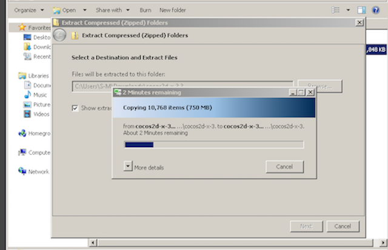
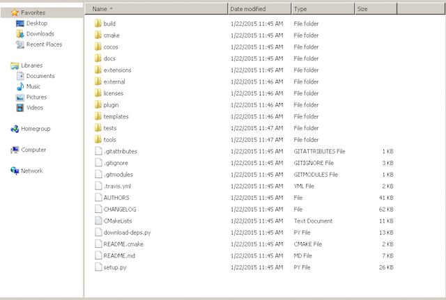
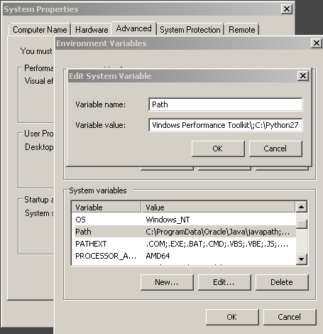
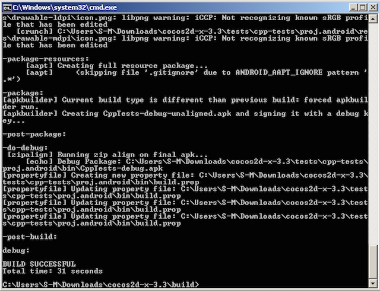
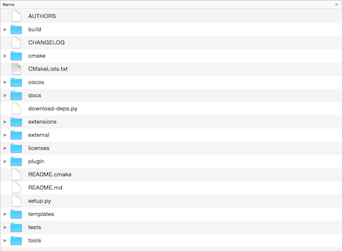
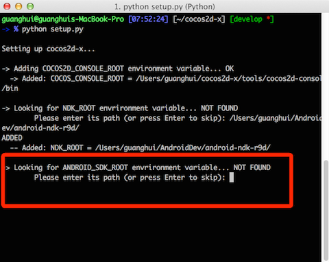
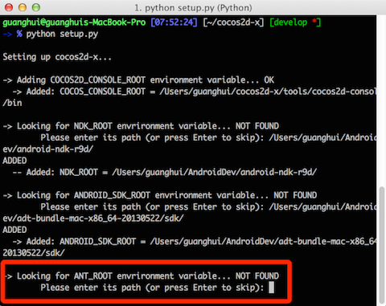

# Appendix B: Android (Terminal) Installation and Setup

## Environment Requirements
* A Supported OS (Ubuntu 12.10+, OS X 10.8+, Windows 7+)

* Cocos2d-x v3.3 [https://cocos2d-x.org/download](https://cocos2d-x.org/download "cocos2d-x")

* JDK/SDK 1.6+ [http://www.oracle.com/technetwork/java/javase/downloads/index.html](http://www.oracle.com/technetwork/java/javase/downloads/index.html)

* Android Studio Bundle [http://developer.android.com/sdk/index.html](http://developer.android.com/sdk/index.html)

* NDK r10c [https://developer.android.com/tools/sdk/ndk/index.html](https://developer.android.com/tools/sdk/ndk/index.html)

* Apache Ant [http://ant.apache.org/bindownload.cgi](http://ant.apache.org/bindownload.cgi)

* Python 2.7.5 [https://python.org/downloads](https://python.org/downloads)

## Prerequisite
* Download *Cocos2d-x*

* Download the *JDK*

* Download the *Android Studio Bundle*

* Download the *NDK*

* Download *Apache Ant*

* Download *Python*

## Windows Instructions
* unzip Cocos2d-x

* install the JDK and verify it works

* install the *Android Studio Bundle* taking note of where you specify the
_Android SDK Installation Location_

* unzip the Android NDK to the same location as the _Android SDK Installation Location_
used from above.

* extract *Apache Ant* and place the entire folder where you wish to keep it.
Take note of where you placed it.

* install *Python* and take note of where you placed it.

* add the paths for *Apache Ant* and *Python* to your PATH variable.

* at the same time create a new variable called: `JAVA_HOME` and give it the
path to where you installed the JDK above.

* reboot

* now, test your environment before continuing. Launch a _command prompt_ and execute:

		> $ ant

		> $ python

* if everything works it is time to run `setup.py` to configure your Android
development environment. This will set the necessary environment variables needed.
If you haven't configured this environment before, you will be prompted to enter
paths for variables that are not found. You run `setup.py` from the directory
cocos2d-x is in.

		> $ setup.py

* enter the paths that you are asked for.

* restart the `cmd` prompt for these settings to take effect

* to build `cpp-tests` `cd` to where you are keeping cocos2d-x and enter the
`build` directory

* run `android list targets` from `sdk/tools` to see what targets you have
available to build for:

* run: `python android-build.py -p <a target from above> cpp-tests`, using the
screenshot above, as an example, run:

		> $ python android-build.py -p 21 cpp-tests

* this will take a while and you will see a lot of source files compiling.

* once complete you will get a `success` message!

## OS X, Linux Instructions
* unzip Cocos2d-x

* install the JDK if your platform requires it.

* unzip the Android SDK and NDK to the same root location.
(maybe: ~/AndroidDev)

* verify that `Python 2.7` is installed and is accessible.

* install `Apache Ant` and verify that it works.

* run: `setup.py` to configure your Android development environment. This will
set the necessary environment variables needed. If you haven't configured this
environment before, you will be prompted to enter paths for variables that are
not found.

** *caution*: You must *not* use the `~` sign. Use the full path to your *home*
directory. Otherwise, the scripts will fail due to error path value.

* in your `cocos2d-x` directory run` python setup.py`

* after setting the environment variables run:

		> $ source ~/.bash_profile

* change your directory to the where the `android-build.py` script is located.
(usually `cocos2d-x/build`)

* to see what targets are available. run:

		> $ android list targets

* execute:

		> $ python android-build.py -p <target # from above> cpp-tests

* everything should build successfully:

## How to deploy it on your Android phone via command line

* enable * [USB Debugging](http://stackoverflow.com/questions/16707137/how-to-find-and-turn-on-usb-debugging-mode-on-nexus-4) *
on your phone and then connect your phone via USB.

* change your directory to the the *bin* directory of your android project

* use `adb` to install the apk to your android phone:

		> $ adb install TestsDemo-debug.apk
