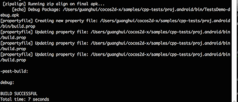

# Appendix B: Android (Terminal) Installation and Setup

## Environment Requirements
* A Supported OS (Ubuntu 12.10+, OS X 10.8+, Windows 7+)

* Cocos2d-x v3.3 [https://cocos2d-x.org/download](https://cocos2d-x.org/download "cocos2d-x")

* JDK/SDK 1.6+ [http://www.oracle.com/technetwork/java/javase/downloads/index.html](http://www.oracle.com/technetwork/java/javase/downloads/index.html)

* Android SDK [http://developer.android.com/sdk/index.html](http://developer.android.com/sdk/index.html)

* NDK r10c [https://developer.android.com/tools/sdk/ndk/index.html](https://developer.android.com/tools/sdk/ndk/index.html)

* Apache Ant [http://ant.apache.org/bindownload.cgi](http://ant.apache.org/bindownload.cgi)

* Python 2.7.5

## Prerequisite
* Download Cocos2d-x and unzip it. (maybe: ~/)

* Download the JDK

* Download the SDK

* Download the NDK

* After downloading them, unzip the SDK and NDK to the same root location.
(maybe: ~/AndroidDev)

* Verify that `Python 2.7` is installed and is accessible.

* Install `Apache Ant` and verify that it works.

* Run `setup.py` to configure your Android development environment. This will
set the necessary environment variables needed. If you haven't configured this
environment before, you will be prompted to enter paths for variables that are
not found.

** Caution: You must *not* use the `~` sign. Use the full path to your *home*
directory. Otherwise, the scripts will fail due to error path value.

** `*COCOS2D_CONSOLE_ROOT*` environment variable to point to the *bin* directory
under *~/cocos2d-x/tools/cocos2d-console* directory.

** `*NDK_ROOT*` environment variable to point to the location of where you put
the NDK. (i.e android-ndk-r9d/)

** `*ANDROID_SDK_ROOT*` environment variable to point to the location of where
you put the `adt-bundle`.  Example `/Users/<your username>/AndroidDev/adt-bundle-mac-x86_64-20130522/sdk/`.
The adt-bundle-mac-x86_64-xxxx, the xxxx number maybe different. So please note
this non-trival difference.

** `*ANT_ROOT*` environment variable to point to the location of where you put
`apache-ant-x.x.x`.  The `apache-ant-x.x.x`, the x.x.x number maybe different.

* In your `cocos2d-x` directory run` python setup.py`

* On unix systems, now issue the following commands:

		source ~/.bash_profile

* On win32 systems, close the command line windows and restart it.

## Use `android-build.py` to build cocos2d-x samples

* Change your directory to the where the `android-build.py` script is located.
(usually `cocos2d-x/build`)

* run:

		android list targets

	to see what targets are available.

* execute:

		python android-build.py -p <target # from above> cpp-tests

* everything should build successfully:

## How to deploy it on your Android phone via command line

* Enable *USB Debugging* [http://stackoverflow.com/questions/16707137/how-to-find-and-turn-on-usb-debugging-mode-on-nexus-4]
(http://stackoverflow.com/questions/16707137/how-to-find-and-turn-on-usb-debugging-mode-on-nexus-4)
on your phone and then connect your phone via USB.

* Change your directory to the the *bin* directory of your android project

* Use **adb** to install the apk to your android phone:
		adb install TestsDemo-debug.apk
